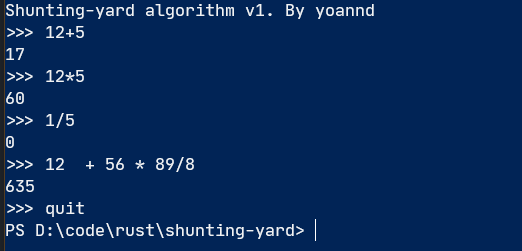

# shunting-yard
Shunting-yard algorithm implementation to parse mathematical expressions.

## Supported features
- Operators: addition, subtraction, multiplication, division
- Other command: `quit`: quit the program

## Coming soon
- Parenthesis
- Unary operators (negation and factorial)
- Basic function (sin, cos, tan, abs, ...)